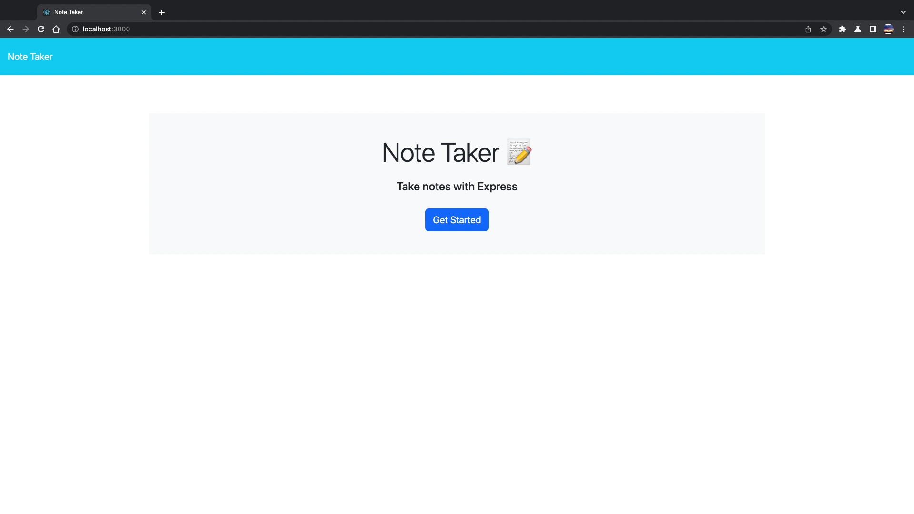
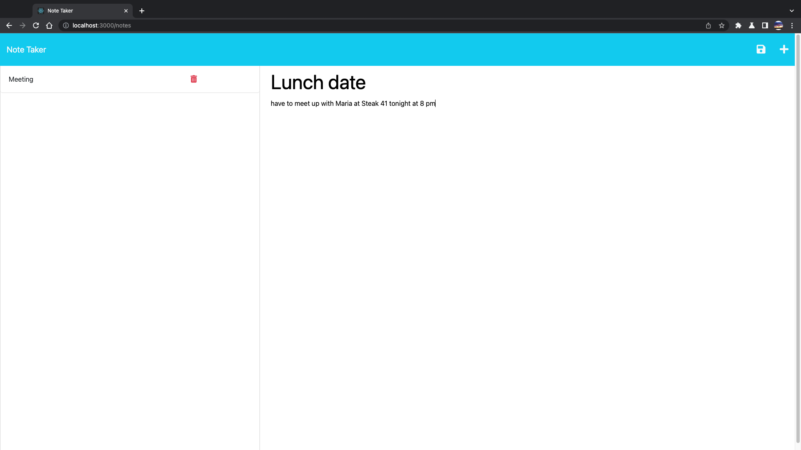
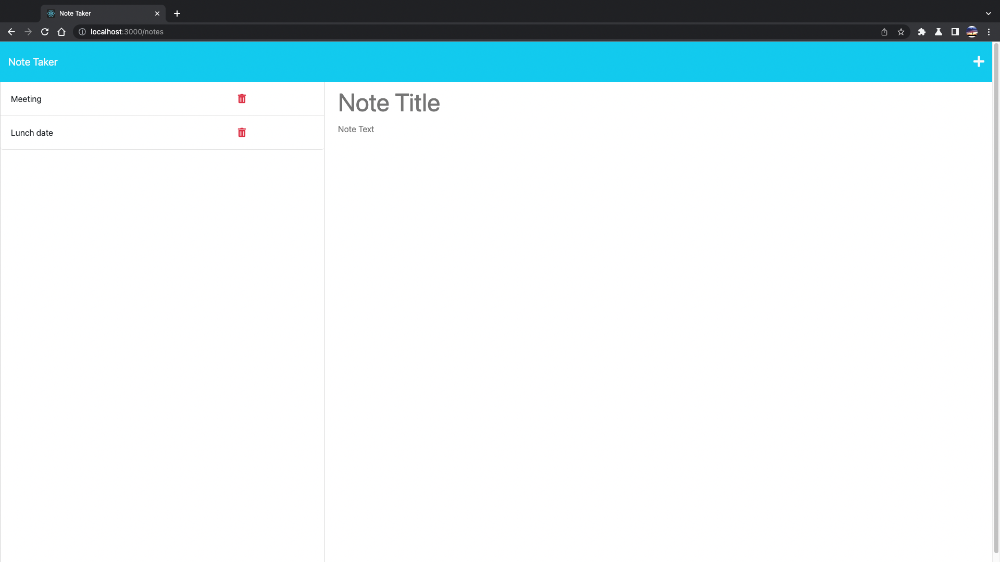
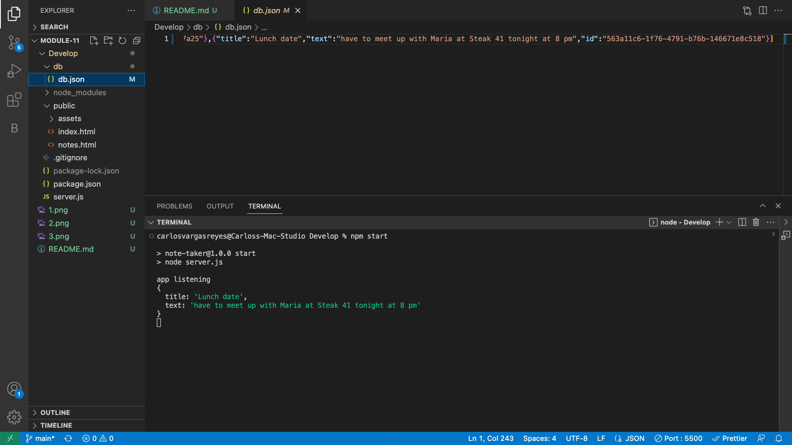

# Module-11 Express.js Challenge: Note Taker
Notes by Carlos for Carlos!

## Description
I need to be able to take and save notes, for me to keep track of anything that I need to get done for the day or in general.

## Acceptance Criteria
WHEN I open the Note Taker
THEN I am presented with a landing page with a link to a notes page
WHEN I click on the link to the notes page
THEN I am presented with a page with existing notes listed in the left-hand column, plus empty fields to enter a new note title and the note’s text in the right-hand column
WHEN I enter a new note title and the note’s text
THEN a Save icon appears in the navigation at the top of the page
WHEN I click on an existing note in the list in the left-hand column
THEN that note appears in the right-hand column

## Usage
To use the Note Taker, you will have to run npm start

## Licence
MIT Licence

## Questions 
My GitHub is CARLIYS, and my Email is carlosvargas3200@gmail.com

